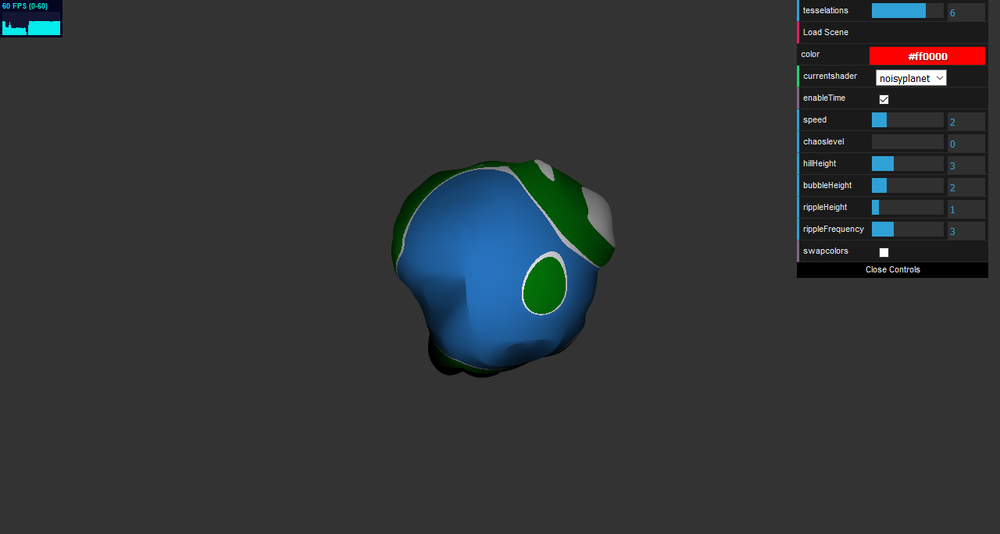
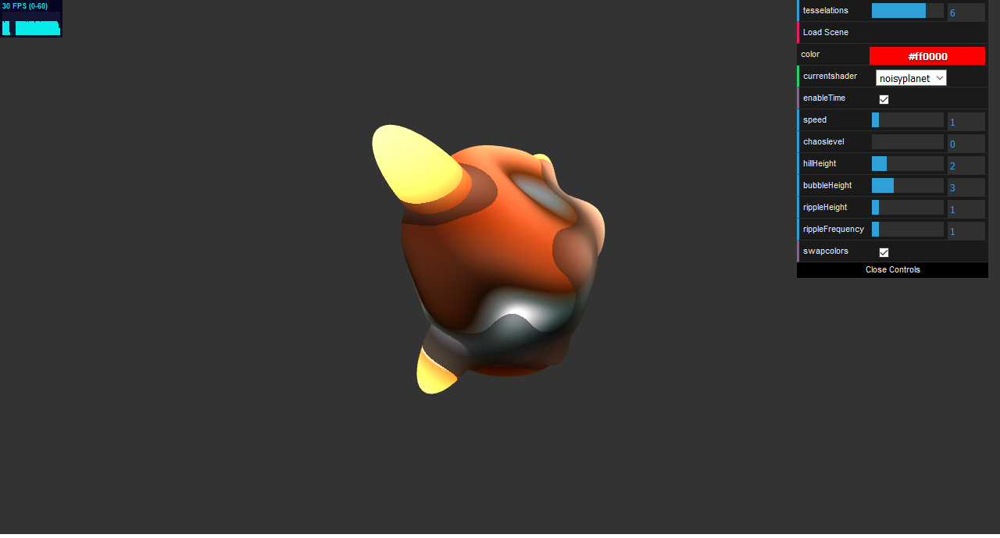
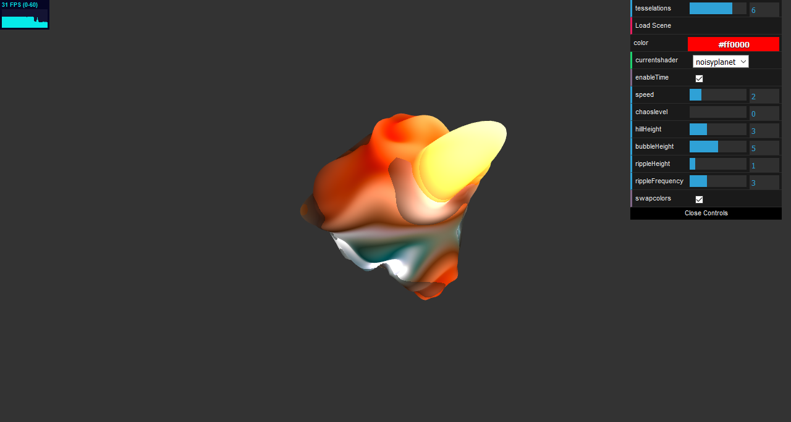
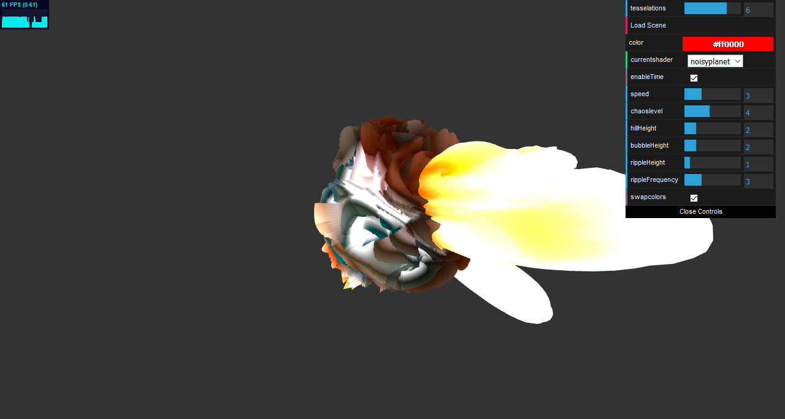

# CIS 566 Project 1: Noisy Planets

## Gabriel Robinson-Barr - grobi
I used the slides and the webgl resource given for help.

For my planet features I used almost exclusively Perlin Noise. I had tried to get other noise functions working but for some reason couldn't get them to look nice, so I stuck with perlin noise. I messed around with input values and modifiers like time, or multiplying the inputs by noise. The "bumps" are very basic perlin noise, the "bubbles" were created by only including noise if it was higher than a specific value and multiplying it by again by perlin noise. The "ripples" were created by using previously calculated perlin noise as part of the input to the perlin noise function.

I have 2 color schemes, the first one was a very basic "planet" where different heights are different colors. I mainly used this one for testing my noise functions since its pretty easy to see the deformation. The second one is meant to be a sort of hot planet or a star, where the inner "core" is a bright white, and the outside glows orange with spouts coming off the surface while patches of "cooler areas" flow over the planet. All of the colors in this scheme except the cool spots were based on a combination of the bump, bubble and ripple heights from the vert shader, and adding colors together based on their respective heights. The cool areas were done by passing a perlin noise value to the frag shader and using it to darken the spot depending on the other height values. Both use lambert shading with a light direction that changes over time simulating a day/night. This day/night is easiest to see with the basic color scheme.

I'm not entirely sure it looks that good and I may have forgotten to look at the instructions often enough to really understand what I was supposed to be going for to be perfectly honest, but I like how it ended up looking.

Basic Planet

Hot Planet

What upping the chaos level does

Github demo page 
https://gaberobinson-barr.github.io/github.io-566hw1-noisy-planets/

## GUI Controls
- The shader for this homework is the default "noisyplanet"
- enableTime turns the time attribute on or off
- speed changes how fast the topology changes
- chaos level shrinks the tile size of the Perlin Noise function
- The last 4 sliders change the noise attributes they are pretty self explanatory and fairly easy to notice the difference at higher values
- swapcolors will swap the color scheme from the hot planet to the basic scheme I used to test

## Objective
- Continue practicing WebGL and Typescript
- Experiment with noise functions to procedurally generate the surface of a planet
- Review surface reflection models

## Base Code
You'll be using the same base code as in homework 0.

## Assignment Details
- Update the basic scene from your homework 0 implementation so that it renders
an icosphere once again. We recommend increasing the icosphere's subdivision
level to 6 so you have more vertices with which to work.
- Write a new GLSL shader program that incorporates various noise functions and
noise function permutations to offset the surface of the icosphere and modify
the color of the icosphere so that it looks like a planet with geographic
features. Try making formations like mountain ranges, oceans, rivers, lakes,
canyons, volcanoes, ice caps, glaciers, or even forests. We recommend using
3D noise functions whenever possible so that you don't have UV distortion,
though that effect may be desirable if you're trying to make the poles of your
planet stand out more.
- Implement various surface reflection models (e.g. Lambertian, Blinn-Phong,
Matcap/Lit Sphere, Raytraced Specular Reflection) on the planet's surface to
better distinguish the different formations (and perhaps even biomes) on the
surface of your planet. Make sure your planet has a "day" side and a "night"
side; you could even place small illuminated areas on the night side to
represent cities lit up at night.
- Add GUI elements via dat.GUI that allow the user to modify different
attributes of your planet. This can be as simple as changing the relative
location of the sun to as complex as redistributing biomes based on overall
planet temperature. You should have at least three modifiable attributes.
- Have fun experimenting with different features on your planet. If you want,
you can even try making multiple planets! Your score on this assignment is in
part dependent on how interesting you make your planet, so try to
experiment with as much as you can!

For reference, here is a planet made by your TA Dan last year for this
assignment:

Notice how the water has a specular highlight, and how there's a bit of
atmospheric fog near the horizon of the planet. This planet used only simple
Fractal Brownian Motion to create its mountainous shapes, but we expect you all
can do something much more exciting! If we were to grade this planet by the
standards for this year's version of the assignment, it would be a B or B+.

## Useful Links
- [Implicit Procedural Planet Generation](https://static1.squarespace.com/static/58a1bc3c3e00be6bfe6c228c/t/58a4d25146c3c4233fb15cc2/1487196929690/ImplicitProceduralPlanetGeneration-Report.pdf)
- [Curl Noise](https://petewerner.blogspot.com/2015/02/intro-to-curl-noise.html)
- [GPU Gems Chapter on Perlin Noise](http://developer.download.nvidia.com/books/HTML/gpugems/gpugems_ch05.html)
- [Worley Noise Implementations](https://thebookofshaders.com/12/)

## Submission
Commit and push to Github, then submit a link to your commit on Canvas.

For this assignment, and for all future assignments, modify this README file
so that it contains the following information:
- Your name and PennKey
- Citation of any external resources you found helpful when implementing this
assignment.
- A link to your live github.io demo (we'll talk about how to get this set up
in class some time before the assignment is due)
- At least one screenshot of your planet
- An explanation of the techniques you used to generate your planet features.
Please be as detailed as you can; not only will this help you explain your work
to recruiters, but it helps us understand your project when we grade it!

## Extra Credit
- Use a 4D noise function to modify the terrain over time, where time is the
fourth dimension that is updated each frame. A 3D function will work, too, but
the change in noise will look more "directional" than if you use 4D.
- Use music to animate aspects of your planet's terrain (e.g. mountain height,
  brightness of emissive areas, water levels, etc.)
- Create a background for your planet using a raytraced sky box that includes
things like the sun, stars, or even nebulae.
